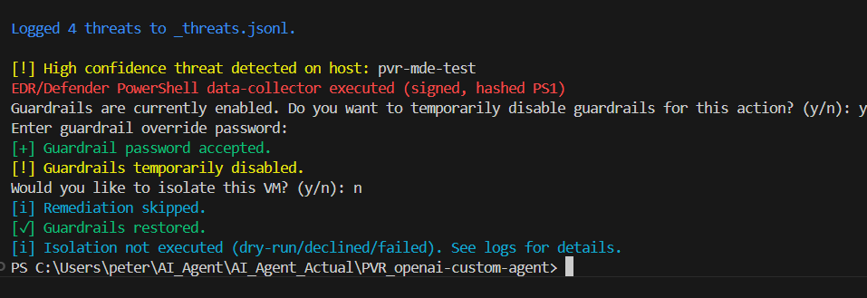

# 🛡️ Agentic Remediation Guardrails

The **Guardrails Framework** provides a unified safety layer that enforces dry-run protection, confirmation prompts, password-verified overrides, and structured logging for all remediation actions. When a high-confidence threat triggers an isolation workflow, the agent first prompts whether to temporarily disable guardrails, then requires a password before proceeding. The standard isolation prompt still follows, ensuring the operator maintains full control of the action. After completion, guardrails automatically restore, and all decisions are logged to `agent.log`. To maintain clarity in the console, concise colorized summaries highlight key guardrail events — password acceptance, temporary disablement, skipped remediation, and restoration — while detailed JSON logs remain available for full auditing.

<p align="center">
  
</p>

---

## ⚙️ @copilot-agent Prompt (Begin)
```
@copilot-agent
Before making code changes, remind me to commit a safe snapshot and propose a clear commit message based on the planned change.
If I haven’t committed yet, tell me exactly which git commands to run and wait for my confirmation.
PLAN-ONLY MODE:
Introduce guardrails for all automated remediation or write operations.
Requirements:
1. Implement a global dry-run mode that logs or prints intended actions without executing.
2. Require explicit user confirmation (y/n prompt) before any real write, delete, or modify operation proceeds.
3. Centralize this in a reusable guardrail function (e.g., confirm_or_dry_run(action_description, execute_callback)) and import it in all remediation paths.
4. Replace abrupt process exits with structured error messages and persistent file logging under a /logs directory.
5. Maintain compatibility with existing structured logging conventions (JSON format).
6. Apply edits one file at a time, stopping after each step for my review and test. Use clear “Diff Summary” and “Proposed Commit Message” sections.
Safety & SOP:
- Remain in PLAN-ONLY mode until I reply “PROCEED STEP 1.”
- Do not modify unrelated logic.
- Wait for “KEEP” confirmation before I run tests.
- After testing, I will perform manual review, commit, and push per SOP.
Objective:
Enhance operational safety by ensuring no unconfirmed or destructive automation can occur without dry-run visibility and human confirmation.
```
## ⚙️ @copilot-agent Prompt (End)

---

### 💡 Rationale
While the AI Agent’s remediation capabilities are designed to assist with threat response and system hardening, any automated write or delete operation introduces potential risk if executed without visibility or explicit consent. The guardrail framework ensures that no unapproved or silent changes can occur, promoting both safety and accountability.

Key safety principles:
- **Transparency:** All intended actions are first displayed in a dry-run mode before execution.
- **User Confirmation:** The system requires explicit analyst approval (`y/n`) before performing any operation.

By centralizing this control in the `confirm_or_dry_run()` helper, all remediation or modification paths inherit consistent safety checks. Abrupt exits are replaced by structured error messages and logs, providing resilience, traceability, and auditability across the workflow.

---

## 🧩 Step 1 — Verify Helper in Isolation

The guardrails feature spans multiple modules (`UTILITIES → GUARDRAILS → EXECUTOR → _main.py`). Each phase introduces interdependent components, so committing per step preserves atomicity and traceability.

**Run a quick syntax check:**
```bash
python -m py_compile UTILITIES.py
```

**Self-test:**
```bash
python _main.py --self-test
```
**Expected Output:**
```json
{"level":"INFO","event":"DRY_RUN_ENABLED"}
```

**Commit Step 1:**
```bash
git add UTILITIES.py
git commit -m "feat(utilities): add centralized guardrails (dry-run, confirmation, structured logging) with persistent logs"
git push
```

> 💡 *Why this matters:* Step 1 establishes the foundational safety utilities that enforce global dry-run behavior and confirmation logic, ensuring no remediation command can execute unguarded.

---

## 🧠 Step 2 — Add Global Safety Toggles and Validate Dry-Run Configuration

**Review the diff:**
```bash
git diff GUARDRAILS.py
```
**Expected new block:**
```python
# Dry-run / safety settings
DRY_RUN_ENABLED = True
LOG_DIR = "logs"
```

**Run test:**
```bash
python _main.py --self-test
```
**Result:**
```json
{"level": "INFO", "event": "PII_REDACTION_CONFIG", "enabled": true, "emails": true, "usernames": false, "ips": false}
```

**Commit Step 2:**
```bash
git add GUARDRAILS.py
git commit -m "feat(guardrails): add DRY_RUN_ENABLED and LOG_DIR with startup validation logs"
git push
```

> ✅ *This step validates that the dry-run and safety toggles initialize correctly, confirming that the system remains stable and redaction behavior is unaffected.*

---

## 🧩 Step 3 — Integrate Guardrails into Remediation Paths

**Review the diff:**
```bash
git diff EXECUTOR.py
```
**Verification Summary:**
- Updated: `quarantine_virtual_machine(token, machine_id)`
- Added internal `_do_isolate()` callback wrapping POST requests.
- Guardrail wrapper: `UTILITIES.confirm_or_dry_run("Isolate VM (machine_id=...)", _do_isolate)`
- Ensures dry-run, confirmation, and structured JSON logging.

**Commit Step 3:**
```bash
git add EXECUTOR.py
git commit -m "refactor(executor): route isolation remediation via centralized guardrails with two-tier confirmation"
git push
```

> 🔒 *Why this matters:* This ensures that even the most sensitive remediation — VM isolation — can only proceed through the centralized guardrail logic with explicit analyst approval.

---

## 🧱 Step 4 — Integrate Guardrail Validation and Structured Fail Logging

**Verification Summary:**
- Added startup validation for guardrail and redaction settings.
- Replaced all `exit()` calls with structured logging via `UTILITIES.fail_and_log()`.
- Refactored `_main.py` to handle controlled termination with `sys.exit()` only after logs persist.

**Test:**
```bash
python _main.py --self-test
```
**Expected:**
```json
{"level": "INFO", "event": "DRY_RUN_ENABLED"}
{"level": "INFO", "event": "LOG_DIR", "path": "logs"}
{"level": "INFO", "event": "PII_REDACTION_CONFIG", "enabled": true, "emails": true, "usernames": false, "ips": false}
```

> 🧩 *Structured shutdowns now ensure that all failures are logged in `agent.log`, providing full auditability of skipped or failed actions.*

---

## 🔐 Step 5 — Password-Protected Guardrail Override

**Goal:** Require authentication before disabling guardrails.

**Behavior:**
- When a user attempts to disable guardrails, the system prompts:
  > "Enter guardrail override password:"
- Password is validated against the environment variable `GUARDRAIL_OVERRIDE_PASSWORD`.
- On success → logs `{ "event": "GUARDRAIL_PASSWORD_ACCEPTED" }` and proceeds.
- On failure → logs `{ "event": "GUARDRAIL_PASSWORD_DENIED" }` and aborts.

> 🧱 *This prevents unauthorized users from disabling guardrails or performing destructive actions.*

---

## 🧩 Step 6 — Final Documentation Summary

**What it does:**
The Guardrail Framework enforces global dry-run protection, interactive confirmations, password authentication for guardrail overrides, and structured JSON audit logging for all remediation workflows. This prevents unauthorized or accidental isolation operations.

**Enhancements:**
- 🔐 Two-tier workflow for high-confidence threats (disable prompt → password → isolate prompt)  
- 🗂️ Persistent JSON audit trail in `logs/agent.log`  
- 🧾 Colorized summaries for core events on console output  
- ⚙️ Structured error handling replaces abrupt exits for safer runtime control

**Example Console Output:**
```
[+] Guardrail password accepted.
[!] Guardrails temporarily disabled.
[i] Remediation skipped.
[✓] Guardrails restored.
```

> ✅ *Final validation confirms complete alignment with the project’s safety, auditability, and operational integrity goals.*
---
## 📌 Author

**Peter Van Rossum**  
🔗 [LinkedIn](https://www.linkedin.com/in/vanr)  
💻 [GitHub](https://github.com/SecOpsPete)  
