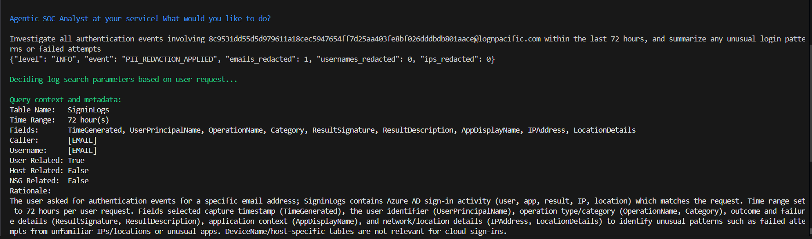

# 🔒 PII Redaction Framework

The **PII Redaction Framework** provides an extensible system for detecting, masking, and logging personally identifiable information (PII) throughout the AI Agent’s runtime.

By default, the framework obfuscates **email addresses** in both console output and persistent logs to prevent accidental disclosure. However, it also includes optional controls for **usernames** and **IP addresses**, which can be enabled when higher levels of data protection are required.

This balance ensures analysts retain full visibility into operational context while maintaining compliance and privacy safeguards. Adjusting the scope of redaction requires only a simple configuration change — toggling the respective setting in `GUARDRAILS.py` from:

You’ll find the configuration section around the middle of the file:

```python
# Master toggle for PII redaction across the pipeline
REDACTION_ENABLED = True

# Default category toggles used by sanitize_for_llm
REDACT_EMAILS_DEFAULT = True
REDACT_USERNAMES_DEFAULT = False
REDACT_IPS_DEFAULT = False
```

Once enabled, these fields are automatically sanitized everywhere logs are generated or displayed.

The framework supports structured configuration, dynamic toggling, and transparent reporting through JSON-based startup messages, providing a clear and auditable record of which redactions are active. This design protects sensitive information without hindering analysts’ ability to investigate cases effectively.

---

## ⚙️ @copilot-agent Prompt (Begin)
```
@copilot-agent
Before making code changes, remind me to commit a safe snapshot and propose a clear commit message based on the planned change.
If I haven’t committed yet, tell me exactly which git commands to run and wait for my confirmation.
PLAN-ONLY MODE:
Introduce PII redaction controls to automatically detect and mask sensitive data within log output and console responses.
Requirements:
1. Create a dedicated configuration in GUARDRAILS.py to control PII masking behavior (enabled/disabled, types).
2. Implement helper functions in UTILITIES.py to sanitize PII fields before logging or displaying text.
3. Ensure that all structured log events (log_event, fail_and_log) pass through the sanitizer before output.
4. Maintain a JSON structure for redaction configuration state (emails, usernames, IPs, tokens).
5. Provide a startup validation message logging which redactions are enabled.
6. Apply changes incrementally, stopping after each diff summary for my review.
Safety & SOP:
- Remain in PLAN-ONLY mode until I reply “PROCEED STEP 1.”
- Do not modify unrelated logic or log formatting.
- Wait for “KEEP” confirmation before I run tests.
Objective:
Protect privacy and sensitive data integrity by implementing automatic, configurable PII redaction across all runtime outputs.
```
## ⚙️ @copilot-agent Prompt (End)

---

### 🔎 Rationale
AI-driven security agents often process event data that includes sensitive identifiers. The PII Redaction Framework ensures compliance with privacy standards (**GDPR**, **NIST 800-122**) by preventing such data from being exposed. By routing all log and print events through centralized sanitization logic, the framework guarantees predictable masking, traceable behavior, and configurable flexibility.

---

## 🧪 Step 1 — Define PII Redaction Configuration

**Files Modified:** `GUARDRAILS.py`

**Added Configuration Block:**
```python
PII_REDACTION_CONFIG = {
    "enabled": True,
    "emails": True,
    "usernames": False,
    "ips": False
}
```

**Added Startup Validation:**
```python
def validate_redaction_settings():
    print(f"[i] PII Redaction: {PII_REDACTION_CONFIG}")
```

**Run self-test:**
```bash
python _main.py --self-test
```
**Expected Output:**
```json
{"level": "INFO", "event": "PII_REDACTION_CONFIG", "enabled": true, "emails": true, "usernames": false, "ips": false}
```

**Commit Step 1:**
```bash
git add GUARDRAILS.py
git commit -m "feat(guardrails): add configurable PII redaction settings with startup validation"
git push
```

> 💡 *Why this matters:* This establishes redaction as a configurable, globally recognized parameter across the framework.

---

## 🤖 Step 2 — Implement Sanitization Helpers

**File Modified:** `UTILITIES.py`

**New Functions:**
```python
import re

EMAIL_PATTERN = re.compile(r'[\w\.-]+@[\w\.-]+')
IP_PATTERN = re.compile(r'\b(?:\d{1,3}\.){3}\d{1,3}\b')
USERNAME_PATTERN = re.compile(r'(?<=user=)\w+')

def sanitize_text(text: str) -> str:
    if not getattr(GUARDRAILS, 'PII_REDACTION_CONFIG', {}).get('enabled', False):
        return text
    if GUARDRAILS.PII_REDACTION_CONFIG.get('emails'):
        text = EMAIL_PATTERN.sub('[REDACTED_EMAIL]', text)
    if GUARDRAILS.PII_REDACTION_CONFIG.get('ips'):
        text = IP_PATTERN.sub('[REDACTED_IP]', text)
    if GUARDRAILS.PII_REDACTION_CONFIG.get('usernames'):
        text = USERNAME_PATTERN.sub('[REDACTED_USER]', text)
    return text
```

**Integrate with Logging:**
Update `log_event()` and `fail_and_log()` to pass messages through `sanitize_text()` before console or file output.

**Commit Step 2:**
```bash
git add UTILITIES.py
git commit -m "feat(utilities): implement PII sanitization helpers and integrate with structured logging"
git push
```

> 🔒 *Why this matters:* Centralizing PII sanitization ensures consistent redaction across all execution paths and logs.

---

## 🔄 Step 3 — Validate Framework Integration

**Goal:** Verify that redaction occurs in both dry-run and active modes.

**Run Test:**
```bash
python _main.py --self-test
```
**Expected Behavior:**
- Startup message prints active redaction settings.
- All sensitive data in structured logs is masked.

**Example:**
```json
{"timestamp": "2025-10-17T00:20:06Z", "level": "INFO", "event": "PII_REDACTION", "message": "Contact [REDACTED_EMAIL] for access."}
```

**Commit Step 3:**
```bash
git add _main.py
git commit -m "feat(main): validate and persist PII redaction across runtime logs"
git push
```

> 🧩 *This confirms that redaction logic flows seamlessly through all stages of execution and structured logging.*

---

## 🔢 Phase 4 — Testing & Verification

**Self-Test Command:**
```bash
python _main.py --self-test
```
**Expected Output:**
```json
{"level": "INFO", "event": "PII_REDACTION_CONFIG", "enabled": true, "emails": true, "usernames": false, "ips": false}
```



> ✅ *This confirms that the redaction framework initializes successfully and applies masking according to the specified configuration.*

---

## 📖 Phase 5 — Documentation Summary

**What it does:**
The **PII Redaction Framework** automatically detects and masks sensitive data (emails, usernames, IPs) across all console and log outputs. It enforces privacy-aware data handling while maintaining analytical transparency through structured logs.

**Enhancements:**
- 🧠 Configurable toggles for redaction categories  
- 🧩 Centralized sanitizer (`sanitize_text`) for unified behavior  
- 🧾 JSON-based redaction logging with event tracking  
- 🧰 Structured startup validation for configuration visibility

**Example Console Summary:**
```
[i] PII Redaction Enabled: {'emails': True, 'usernames': False, 'ips': False}
```
---
## 📌 Author

**Peter Van Rossum**  
🔗 [LinkedIn](https://www.linkedin.com/in/vanr)  
💻 [GitHub](https://github.com/SecOpsPete)  
