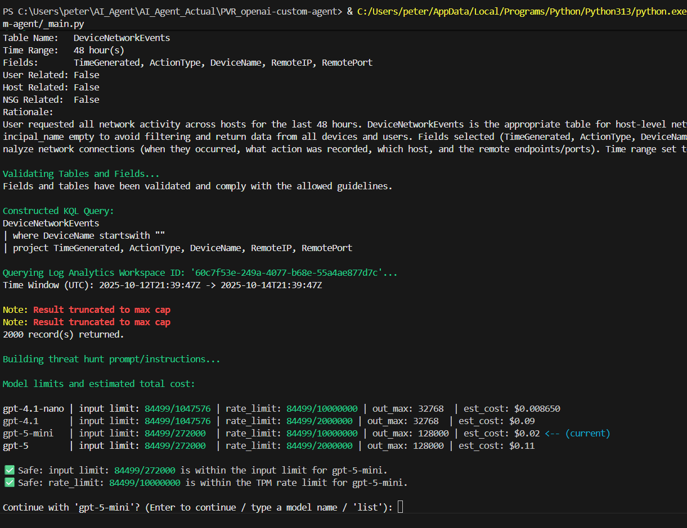

# 🧠 Agentic AI Threat-Hunting Model — 🔢 Row and Byte Cap Enforcement

The **Row and Byte Cap Enforcement** system introduces performance safety controls that ensure query results sent to the model remain within manageable limits. This prevents excessive data from being processed in a single query, maintaining stable execution times and token efficiency while ensuring results remain complete and interpretable.

---

## 🧩 Overview

The cap system is implemented as a reusable helper within `UTILITIES.py` and integrated into the agent’s primary data-handling functions in `EXECUTOR.py`. It establishes upper bounds on both row count and total payload size:

- **Maximum Rows:** 2,000  
- **Maximum Payload Size:** 1 MB (JSON)

When these thresholds are reached, the agent safely truncates the output, logs a structured warning, and displays a colorized console message. This mechanism helps prevent excessive resource usage and ensures queries remain performant even when analysts request large datasets.



---

## ⚙️ Copilot Prompt — PLAN-ONLY Mode

```
@copilot-agent

Enforce row/byte caps on all query and API results.

Requirements:
1. Max rows = 2000, Max payload size = 1 MB (JSON).
2. If caps are exceeded, summarize/cluster/truncate safely and include a note in the result metadata.
3. Centralize this logic in a wrapper function called cap_results(data).
   - Place it in UTILITIES.py (or the most appropriate shared helper module).
   - Ensure it is called anywhere results are aggregated or returned.
4. Add minimal checks or tests proving these caps are enforced.

Implementation guidance:
- Use len() to count rows.
- Use sys.getsizeof() or json.dumps() to estimate payload size.
- When caps are exceeded, return only the first N rows (up to 2000) and add a key like {"note": "Result truncated to max cap"}.
- Keep code defensive and safe for all data types.

Explain what you changed and stop after updating **one file at a time** so I can test before continuing.
```

💡 *Rationale:* Limiting the output size maintains consistent system responsiveness and prevents performance degradation from large result sets. It aligns with the AI Agent’s **guardrail philosophy** — enforcing safe, explainable, and predictable automation.

---

## 🧪 Phase 1 — Verify Helper in Isolation

Before integration, the helper function was implemented and validated in isolation within `UTILITIES.py`.

### 🔍 Verification Steps
1. Run a syntax check:
   ```bash
   python -m UTILITIES
   ```
2. Expected result:
   ```
   cap_results self-checks passed.
   ```

This confirms the helper function is syntactically valid and logically sound.

---

## 💡 Phase 2 — Integrate Helper into Agent

After validation, the next step integrated the helper into `EXECUTOR.py` to control query and API result size:

```
@copilot-agent
integrate cap_results into EXECUTOR.py next
```

This connected the logic to both `query_log_analytics()` and `hunt()` functions, ensuring large datasets were truncated before summarization or output.

---

## ⚛️ Phase 3 — Test Integration & Colorized Output

Natural-language test:
> Show me all DeviceProcessEvents from the last 48 hours so I can look for suspicious PowerShell activity.

If truncation triggers, the console shows:
```bash
Note: Result truncated to max cap
```

To improve visibility, Copilot was instructed to colorize this output:
- **"Note:"** → Yellow (`Fore.LIGHTYELLOW_EX`)  
- **"Result truncated to max cap"** → Bright Red (`Fore.RED + Style.BRIGHT`)

This consistent color scheme improves readability and testing feedback.

---

## 🔄 Phase 4 — Commit and Version Control

### 🔖 Stage and Commit Changes
```bash
git status
git add EXECUTOR.py UTILITIES.py
git commit -m "style(output): colorize truncation messages for clarity"
git push
```

Verify via GitHub:
- <your-private-github-repo-url>
- Review recent commit history and confirm updated files.

Local verification:
```bash
git log --oneline -n 5
```


---

## 📖 Phase 5 — Document the Update

### 🛡️ What It Does
The `cap_results()` helper enforces consistent safety limits across all data-handling routines, preventing performance bottlenecks or memory spikes.

### 📈 Behavior Summary
- **Row limit:** Truncates to 2,000 rows.  
- **Byte limit:** Caps payloads over 1 MB.  
- **User feedback:** Displays colorized console messages and logs structured events (`RESULT_TRUNCATED`).  
- **Model safety:** Optimizes token use and stabilizes query performance.

---

## 🔎 Summary

Row and Byte Cap Enforcement enhances the Agent’s performance reliability and aligns automation with analyst intent. It ensures every query and API call stays within validated limits.

---
## 📌 Author

**Peter Van Rossum**  
🔗 [LinkedIn](https://www.linkedin.com/in/vanr)  
💻 [GitHub](https://github.com/SecOpsPete)  
