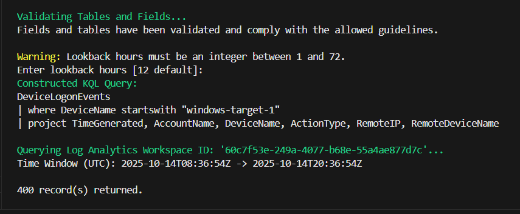

# 🧠 Agentic AI Threat-Hunting Model — ⏱️ Time Window Enforcement

The Time Window Enforcement feature ensures that all hunts and queries executed by the AI Agent remain focused, efficient, and restricted to analyst-approved time ranges. This prevents overly broad data pulls, reduces token and compute load, and enforces operational boundaries consistent with SOC best practices.

Built on the base Agentic AI model originally developed in The Cyber Range classroom labs, this and other customization modules were extended with GitHub Copilot Pro assistance and implemented in Python.

---

## 🧩 Overview

Time Window Enforcement introduces a centralized helper function — `get_time_window()` — implemented in `UTILITIES.py`.  
This function standardizes the time range logic across all hunting and data-fetching modules (e.g., KQL queries, API calls, and internal analytics routines).  
It ensures every query runs within a defined range, typically the **last 12 hours by default**, and never exceeds **72 hours**.

This design not only optimizes query performance but also reinforces compliance with data retention policies and investigation scope limitations.

---

## ⚙️ Copilot Prompt — PLAN-ONLY Mode

```
@copilot-agent

Implement time-window enforcement across data-fetching, hunting queries, and API calls.

Context:
- Add this feature into UTILITIES.py as a reusable helper named get_time_window().
- This helper should be imported wherever KQL queries or API pulls define a time range.

Requirements:
1. Default lookback window = 12 hours; allow override up to 72 hours with explicit parameter.
2. Add validation to reject values outside 1–72 hours.
3. Ensure all KQL queries, API fetches, and data pulls use this window by default.
4. Provide a single helper function (get_time_window()) returning (start_iso, end_iso) in UTC ISO8601 (e.g., 2025-10-14T03:00:00Z).
5. Use only Python standard library modules datetime and timezone.
6. Do not modify unrelated code.
7. After changes, list all files touched and show a brief diff summary for each.
```

💡 *Rationale:*  
The Context block tells Copilot where the change belongs.  
The Requirements list gives explicit structure (each line = acceptance criterion).  
“Do not modify unrelated code” keeps the edit focused.  
The diff summary request makes Copilot show what changed without executing edits automatically.

---

## 🧪 Phase 1 — Verify Helper in Isolation

Before integration, the helper was tested in isolation to ensure correctness and validation safety.

### 🛠️ Test Procedure

```python
from UTILITIES import get_time_window
print(get_time_window())               # Expect 12-hour UTC range
print(get_time_window(override_hours=24))  # Expect 24-hour UTC range
print(get_time_window(override_hours=100)) # Expect ValueError
```

### 🔍 Expected Results
- Outputs display ISO8601 timestamps with a `Z` suffix.
- Invalid override values (outside 1–72) raise a validation error.
- The helper uses only Python’s `datetime` and `timezone` modules.

---

## 💡 Phase 2 — Integrate into Agent

After validation, the next step refactored all time logic across the project to use the new helper.

```
@copilot-agent

Refactor existing code to use the get_time_window() helper from UTILITIES.py.

Context:
- The helper is already implemented and tested.
- It enforces a 12-hour default window and a 72-hour max override.

Task:
1. Find all functions or modules that manually calculate start/end datetimes for KQL, API, or hunting queries.
2. Replace those calculations with:
      start_time, end_time = get_time_window()
3. Do not create new functions or duplicate the helper.
4. Leave all unrelated code untouched.
5. After changes, list all files modified and show a short diff summary for each.
```

### 📊 Verification Summary
- The helper function passed all unit tests.  
- Copilot’s scan confirmed there were no remaining manual time calculations.  
- No behavioral changes occurred — only standardized function calls.

---

## ⚛️ Phase 3 — Interactive Enhancement for Invalid Input

During testing, the Agent threw an error when time frames were not specified. To handle this gracefully, an interactive fallback system was introduced.

```
@copilot-agent

Enhance get_time_window() in UTILITIES.py to handle invalid lookback_hours interactively.

Requirements:
1. If lookback_hours is outside the allowed 1–72 range, do NOT raise an error.
2. Instead, print a warning and prompt the user to enter a valid number of hours.
3. Accept integer input only; if the user enters an invalid value twice, fall back to the default 12 hours.
4. Maintain the same return structure (start_iso, end_iso).
5. Ensure behavior remains non-interactive safe: if running in a non-interactive context, automatically fall back to 12 hours instead of prompting.
6. Do not modify unrelated code. After implementing, list files changed and summarize the diff.
```

### 🔧 Test Procedure

```bash
python
from UTILITIES import get_time_window
print(get_time_window(96))
exit()
```

Then test full integration:

```bash
python main.py
```

### 📊 Expected Results
- When `lookback_hours` is out of range, user is prompted for valid input.  
- If invalid twice, it safely defaults to 12 hours.  
- In non-interactive mode, the agent automatically defaults to 12 hours.  
- Queries in logs reflect valid `start_time` and `end_time` windows.



---

## 🔄 Phase 4 — Commit and Version Control

### 🔖 Stage and Review Changes

```bash
git add UTILITIES.py
git diff --name-only
git diff EXECUTOR.py
git diff GUARDRAILS.py
git diff MODEL_MANAGEMENT.py
```

Only commit verified changes:

```bash
git status
git add UTILITIES.py EXECUTOR.py GUARDRAILS.py MODEL_MANAGEMENT.py
git commit -m "feat(time-window): integrate get_time_window helper, enforce model consistency, and remove deprecated models with interactive prompt and safe fallback for invalid ranges"
git push --tags
```

Verify the update on GitHub:
- 🔗 [Custom AI Threat Hunt Agent](https://github.com/SecOpsPete/Custom_AI_Threat_Hunt_Agent)
- Check latest commit for affected files.

Confirm locally:

```bash
git log --oneline -n 5
```


---

## 📖 Phase 5 — Document the Update

### 🛡️ What It Does
- The `get_time_window()` helper standardizes query time range enforcement across all modules.
- Ensures default lookback = 12 hours; allows user override up to 72 hours.
- Provides safe fallback behavior in both interactive and automated contexts.

### 💪 Benefits
- **Consistency:** All queries use the same validated time logic.  
- **Safety:** Prevents unbounded searches that could overwhelm APIs or the model.  
- **Performance:** Limits data size and token load per request.  
- **User Experience:** Graceful fallback ensures uninterrupted use, even with invalid input.

---

## 🔎 Summary

Time Window Enforcement strengthens the AI Agent’s reliability by aligning automation with human intent.  
It ensures every hunt or API call operates within a clearly defined, validated time range — maximizing performance while preserving analyst control.

---
## 📌 Author

**Peter Van Rossum**  
🔗 [LinkedIn](https://www.linkedin.com/in/vanr)  
💻 [GitHub](https://github.com/SecOpsPete)  
